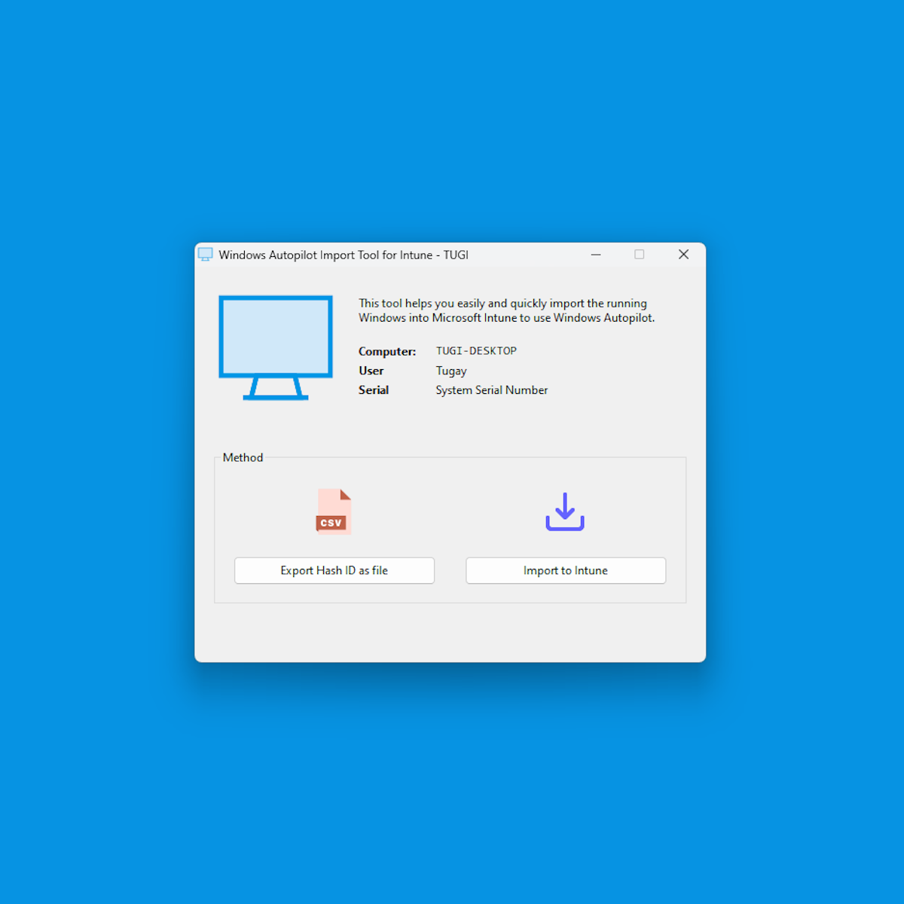

# Win Autopilot Import Tool (WinAutopilotImport)

<!-- ABOUT THE PROJECT -->
Have you ever tried to explain the Windows Autopilot device import process to any customer?
With this application, you can provide your customers with an simple GUI to import their devices into Microsoft Intune to register them with Windows Autopilot.  

<!-- GETTING STARTED -->
## Getting Started

### Prerequisites
All dependencies/requirements are automatically installed by the PowerShell scripts. 
The scripts are based on the official Microsoft article with some modifications to force any module installation with the **-Force** parameter. https://learn.microsoft.com/en-us/autopilot/add-devices
  
**It will automatically install the following components**
- PowerShell: NuGet (Package Manager)
- PowerShell: Get-WindowsAutopilotInfo (Module)

### Installation
You can download the latest release via GitHub - No installation is required to use this application.

<!-- USAGE EXAMPLES -->
## Usage
All you need to do is run WinAutopilotImport executable. 
Please sign in as an Intune administrator to import the device directly (online).
 

## Modifications
You can find all the commands in the .\Scripts folder that will be executed and report the exit code back to the GUI. If PowerShell scripts returns an exit code other than 0, the application automatically displays the PowerShell error message.

## Compile
The project is based on the PureBasic language, available at: https://www.purebasic.com. 
The project file is included for the PureBasic IDE.

<!-- LICENSE -->
## License
Distributed under the GNU License. See `LICENSE` for more information.  
This tool is provided "as is" with no warranties. Always test scripts and tools in a safe and recoverable environment before using them on a production environment/device.

<!-- CREDITS -->
## Credits
Get-WindowsAutopilotInfo (by Microsoft) - [Get-WindowsAutopilotInfo](https://www.powershellgallery.com/packages/Get-WindowsAutopilotInfo)

<!-- CONTACT -->
## Contact
TUGI - [contact@tugi.ch](mailto:contact@tugi.ch) 
Project Link: [https://blog.tugi.ch/scripts-and-tools/winautopilotimport](https://blog.tugi.ch/scripts-and-tools/winautopilotimport)
